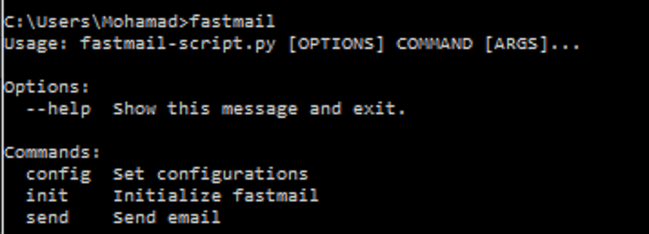
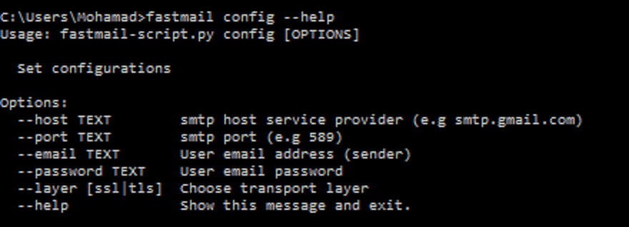
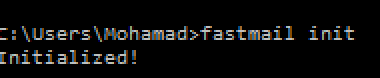

#A simple command line tool for sending email via SMTP

### Modules:

  *  **_cli.py_**  which is responsible for command line interfacing
  
  *  **_email_sender.py_** which is responsible for handling the sending request
 
 
### Tool options:
  * **Config**: Set the configurations ( used only once unless you want to change the configs )
    * **--port**: Port number (e.g. 469)

    * **--host**: Host service (e.g. smtp.gmail.com)

    * **--email**: User email

    * **--password**: User password

    * **--layer**: Use tls | ssl 
  
  * **init**: Initialize the tool (used only once after installation)
  
  * **send**: Send the email message,
  
 
 
###Usage:
  
  **1. ```fastmail init```**
  
  **2. ```fastmail config --port XXX --host XXX --email XXX --password XXX --layer XXX```**
  
  **3. ```fastmail send```**    
  then the user will be prompted to enter reciever email, subject & message body
  
  

###You can find compiled binary of the tool for windows

  <a href="https://sourceforge.net/projects/fastmail-sender/files/latest/download" rel="nofollow"></a>

###Screenshots





